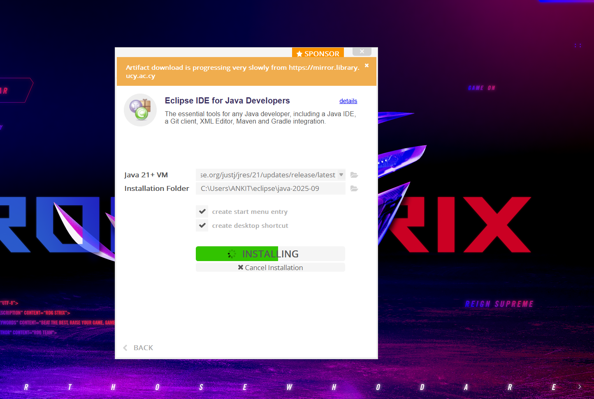

# Campus Course & Records Manager (CCRM)

## Project Overview
The **Campus Course & Records Manager (CCRM)** is a Java SE console application for managing students, courses, enrollments, grades, and file utilities.  
It demonstrates OOP principles, exception handling, Java Streams, modern I/O (NIO.2), enums, design patterns (Singleton, Builder), and recursive utilities.

---

## ● Evolution of Java (short timeline)
- **1995 – Java 1.0** → First release (applets, AWT).  
- **1997 – Java 1.1** → Inner classes, JavaBeans, JDBC.  
- **1998 – Java 2 (SE 1.2)** → Swing, Collections, Plug-in.  
- **2002 – Java SE 1.4** → assert keyword, Exception chaining, NIO.  
- **2004 – Java SE 5.0** → Generics, Annotations, Autoboxing, Enhanced for-loop.  
- **2006 – Java SE 6** → Performance, Scripting API.  
- **2011 – Java SE 7** → Try-with-resources, diamond operator, nio.2.  
- **2014 – Java SE 8** → Lambdas, Streams, Date/Time API.  
- **2017 – Java SE 9** → Module system (Jigsaw), JShell.  
- **2018 – Java SE 11 (LTS)** → var keyword, modern APIs.  
- **2021 – Java SE 17 (LTS)** → Records, Sealed classes, Pattern matching.  
- **2023 – Java SE 21 (LTS)** → Latest refinements, improved performance.  

---

## ● Java Editions: ME vs SE vs EE

| Edition | Purpose | Features | Platforms |
|---------|---------|----------|-----------|
| **Java ME** (Micro Edition) | For embedded & IoT devices | CLDC, CDC, lightweight runtime, device-specific libraries | Phones, IoT, constrained devices |
| **Java SE** (Standard Edition) | General-purpose applications | Full core libraries (Collections, Streams, Concurrency, I/O), JDK tools | Desktops, laptops, servers |
| **Java EE** (Enterprise Edition, Jakarta EE) | Enterprise-scale applications | Servlets, JSP, JPA, EJB, JMS, CDI, Web/REST APIs | Application servers, enterprise backends, cloud |

---

## ● Java Architecture: JDK, JRE, JVM

- **JVM (Java Virtual Machine)**  
  Runs Java bytecode (`.class` files). Provides class loading, JIT compilation, garbage collection.  
- **JRE (Java Runtime Environment)**  
  Contains JVM + standard libraries required to *run* Java apps. Does not include compiler.  
- **JDK (Java Development Kit)**  
  Superset of JRE. Includes `javac`, debugger, Javadoc, and tools for developers.  

👉 Flow: **JDK (developer builds code) → JRE (runtime environment) → JVM (executes bytecode).**

---

## ● Install & Configure Java on Windows

1. **Download JDK** from [Oracle](https://www.oracle.com/java/technologies/downloads/) or [Adoptium](https://adoptium.net/).  
2. **Run Installer** → choose install path (e.g., `C:\Program Files\Java\jdk-17`).  
     
3. **Set Environment Variables**  
   - Add `JAVA_HOME` → path to JDK.  
   - Update `Path` → add `%JAVA_HOME%\bin`.  
4. **Verify Installation**  
   ```bash
   java -version
   javac -version
